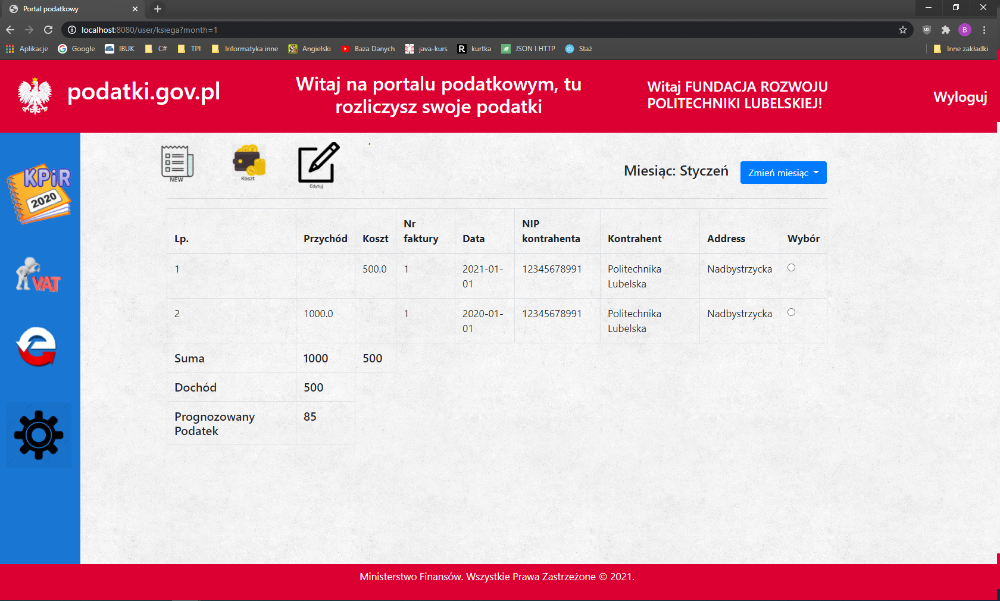
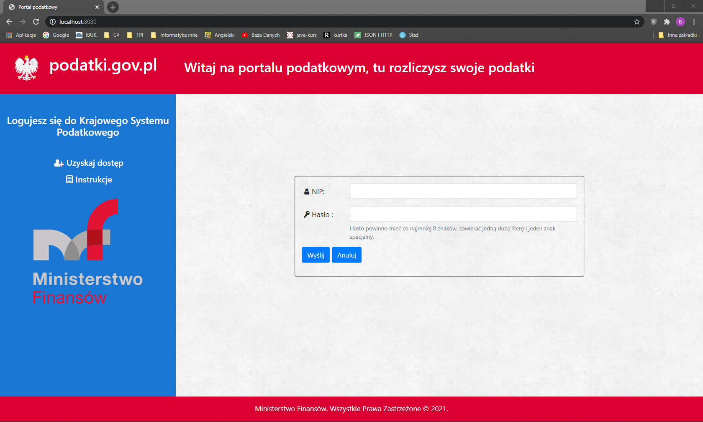
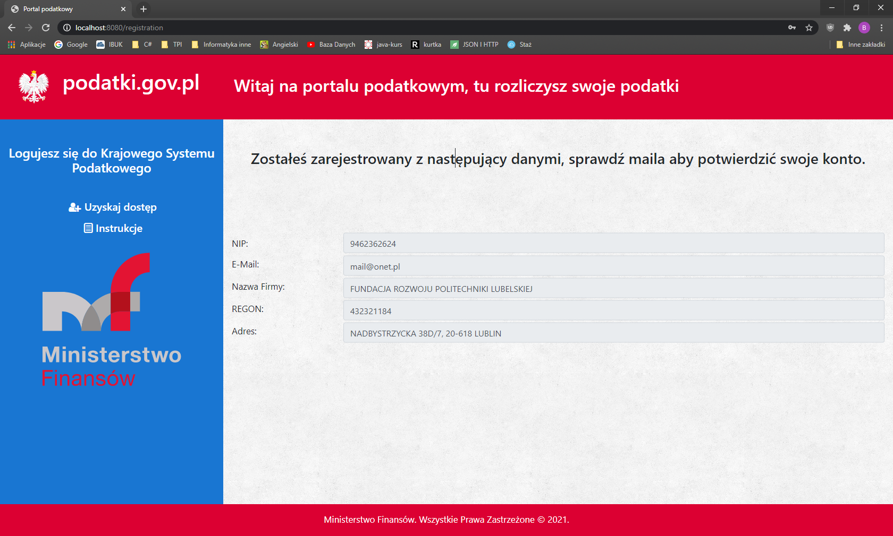

# Tax office 
>Main function of this application is possibility of settling taxes over the Internet. You can add new invoice, cost and pay taxes online.   

## Table of contents
* [General info](#general-info)
* [Screenshots](#screenshots)
* [Technologies](#technologies)
* [Features](#features)
* [Status](#status)
* [Source](#source)
* [Contact](#contact)

## General info
This project was made using java version 11 and framework Spring. On the first page Customer can log on, or Register. If he choose registration all data will be downloaded from Ministry of Finanse using REST API.  What is more, custemer must verify themself by email. After logging in Client can choose between VAT settlement, PIT or paying this taxes over Internet, using PayU.

## Screenshots

## Technologies
* Java - version 11
* Spring Boot 
* Thymeleaf 
* JUNIT 
* H2 Database
* HTML5 
* Bootstrap 

## Features
List of features ready and TODOs for future development
*   Enables registration and login 
*   First page - "KPiR" enables add new invoice, cost and show forecast tax

To-do list:
*   Connect with PAYU
*   Implementation of other subpages

## Status
Project is: project in progress 

## Source
* [https://www.iconfinder.com/](https://www.iconfinder.com/) 

## Contact
Created by [@Bartistero](https://github.com/Bartistero/) - feel free to contact me!